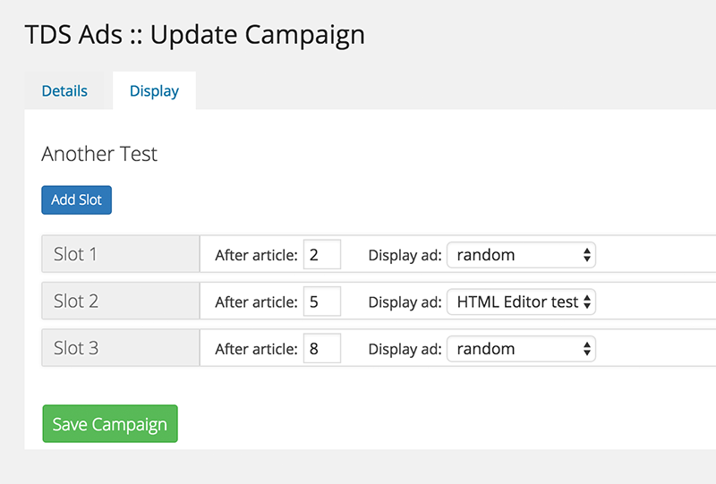

## Disclaimer

This plugin is specifically designed for [The Daily Sheeple](http://www.thedailysheeple.com)
and may have undesired effects if used in its current state elsewhere. This plugin is provided
as-is with no assumed support or warrantee of any kind.

## Overview

This plugin allows for setting up advertising campaigns within your admin panel and controlling
their display order on your site. By referencing specific campaigns in different areas of your
theme, you can have granular control over their rendering. Additionally, if you set up your ad
slots to randomize, the randomization will be honored on the client side, even if you're using
a WP Theme cache.

### Installation

Clone this repository and install into the Wordpress plugins directory as any standard plugin.
When you activate, this plugin will install a handful of custom tables into your WordPress
database, using your WP instance prefix.

### Usage

Once installed, there are a couple different pieces to this plugin. First, we have to set up
our advertisers, ads, campaigns and view rules. Once this is done, we have to modify our
templates to specify which campaign we wish to display in our post listings. You can find the
entry into the ad management under the new TDS Ads link in the admin menu:


From the ads page, you will be able to create, update and delete both advertisers and
individual advertisements. Advertisements are comprised of a reference to an advertiser, a
name and some raw HTML content. There is a syntax highlighter to help you be sure your content
is valid HTML. As you enter advertisers and ads, you will see them listed on this screen.


The campaign dashboard is where the magic happens. When you create a new campaign, you will be
prompted to select which ads you want in your campaign. Keep in mind that you need to select
*all* ads that you wish to appear at any point in your campaign.


When creating a campaign, the details are pretty self explanatory, but the *Display* tab may
merit a picture here. You have the option to specify as many "slots" as you wish. Each slot
has the concept of being injected _after_ a specified ad. This will be more clear when we get
into the code necessary to integrate with this system. Finally, each slot is able to specify
an ad to be rendered - if none is provided, random is the default, and a random ad will be
chosen to render into the slot.



Once you have fully configured your campaign and view rules, you can integrate your template
to automatically calculate and render your ads into your loops.

### Rendering Rules

As campaigns are rendered, there are a few rules that are followed. If your ads are not being
displayed quite like you expected, refer to the following checklist to be sure you have
configured your campaign appropriately:

1. First, no ad will *ever* appear more than one time in a given campaign. If you have
configured an ad to be rendered in a sticky slot, it will not ever appear in a random slot
within the same campaign.
2. Sticky slots are rendered *first*. Random slots are then calculated and rendered from the
remaining ads within the campaign.
3. Random slots are always calculated from the top down. If you have configured five slots to
be randomized, but only 4 ads are remaining in your campaign, the last slot will remain empty.

Let's walk through a possible configuration that might cause confusion without putting some
thought into it. Assume we have the following configuration:

> _Ads:_
> [10] Test Ad 1
> [18] Test Ad 2
>
> _Slots:_
> [1] After article 2, Test Ad 1 is displayed
> [2] After article 5, random ad is displayed
> [3] After article 8, Test Ad 2 is displayed

This is a legitimate configuration, but in reality, only two ads will be rendered, one after
article 2 and another after article 8. Can you see why? Notice that there are only _two_ ads
configured for this campaign. Understanding that no ads will ever be duplicated within the
campaign helps us understand, but why isn't the second ad displayed after article 5?

Well, if we read rule number 2 above, *sticky slots are rendered first*. If we do not calculate
their display first, there is no guarantee they will be sticky, becuase the random slots may
use up all viable ads before we reach the sticky slot, and we can't have that happen! So, we
have the following render path:

* Cache the configured ads ([10] and [18])
* Cache the configured slots
* Group the slots into sticky and random (2 and 1 respectively)
* Render the sticky slots (after article 2 and 8)
* Render the random slots with whatever ads are left (none in this case)

As you can see, we have followed our rules and simply ran out of viable ads to render before
we could fulfill the request to render the random slots.

### Template Integration

We have built a system for the easiest integration we could think of. By triggering an action
within a post loop and providing a campaign ID and the current index of the loop, the plugin
will render all the appropriate markup and JavaScript to render your specified ads. Notice the
`hook` column in the campaign list view. This is the name of your action that you need to 
execute to render that campaign.

Assume we have created a campaign with the ID of `8`: this will show up with a hook of
`tds_campaign_8` in our list view. Now, the following code will render this campaign within a
loop of posts in our site:

```
// Loop over the posts, and use the index to call our new action
if (have_posts()): // start the loop
    $index = 0;
    while (have_posts()): the_post();
        ++$index;

        // Do whatever you want to render your post
        get_template_part('content', get_post_format($post->ID));

        // This is the magic code to apply the ad campaign to this loop
        do_action('tds_ad_campaign', 'tds_campaign_8', $index);
    ehdwhile;
endif;
```
