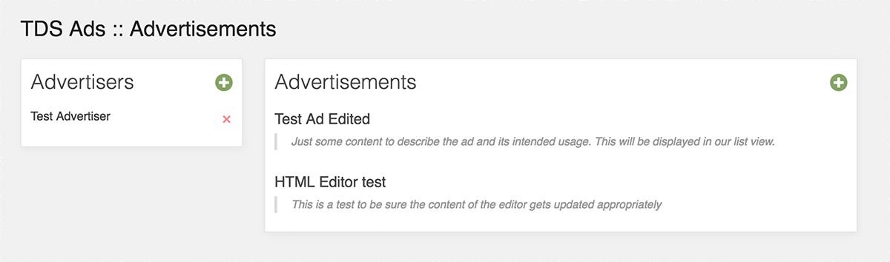
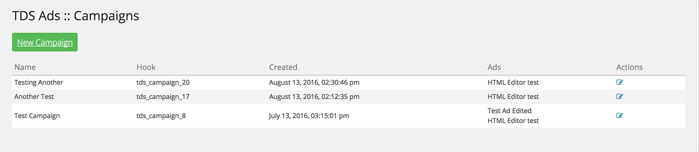

## Disclaimer

This plugin is specifically designed for [The Daily Sheeple](http://www.thedailysheeple.com)
and may have undesired effects if used in its current state elsewhere. This plugin is provided
as-is with no assumed support or warrantee of any kind.

## Overview

This plugin allows for setting up advertising campaigns within your admin panel and controlling
their display order on your site. By referencing specific campaigns in different areas of your
theme, you can have granular control over their rendering. Additionally, if you set up your ad
slots to randomize, the randomization will be honored on the client side, even if you're using
a WP Theme cache.

### Installation

Clone this repository and install into the Wordpress plugins directory as any standard plugin.
When you activate, this plugin will install a handful of custom tables into your WordPress
database, using your WP instance prefix.

### Usage

Once installed, there are a couple different pieces to this plugin. First, we have to set up
our advertisers, ads, campaigns and view rules. Once this is done, we have to modify our
templates to specify which campaign we wish to display in our post listings. You can find the
entry into the ad management under the new TDS Ads link in the admin menu:

From the ads page, you will be able to create, update and delete both advertisers and
individual advertisements. Advertisements are comprised of a reference to an advertiser, a
name and some raw HTML content. There is a syntax highlighter to help you be sure your content
is valid HTML. As you enter advertisers and ads, you will see them listed on this screen.

The campaign dashboard is where the magic happens. When you create a new campaign, you will be
prompted to select which ads you want in your campaign. Keep in mind that you need to select
*all* ads that you wish to appear at any point in your campaign.

### Rendering Rules

As campaigns are rendered, there are a few rules that are followed. If your ads are not being
displayed quite like you expected, refer to the following checklist to be sure you have
configured your campaign appropriately:

1. First, no ad will *ever* appear more than one time in a given campaign. If you have
configured an ad to be rendered in a sticky slot, it will not ever appear in a random slot
within the same campaign.
2. Sticky slots are rendered *first*. Random slots are then calculated and rendered from the
remaining ads within the campaign.
3. Random slots are always calculated from the top down. If you have configured five slots to
be randomized, but only 4 ads are remaining in your campaign, the last slot will remain empty.
