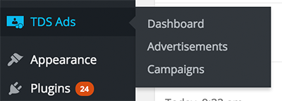

## Disclaimer

This plugin is specifically designed for [The Daily Sheeple](http://www.thedailysheeple.com)
and may have undesired effects if used in its current state elsewhere. This plugin is provided
as-is with no assumed support or warrantee of any kind.

## Overview

This plugin allows for setting up advertising campaigns within your admin panel and controlling
their display order on your site. By referencing specific campaigns in different areas of your
theme, you can have granular control over their rendering. Additionally, if you set up your ad
slots to randomize, the randomization will be honored on the client side, even if you're using
a WP Theme cache.

### Installation

Clone this repository and install into the Wordpress plugins directory as any standard plugin.
When you activate, this plugin will install a handful of custom tables into your WordPress
database, using your WP instance prefix.

### Usage

Once installed, there are a couple different pieces to this plugin. First, we have to set up
our advertisers, ads, campaigns and view rules. Once this is done, we have to modify our
templates to specify which campaign we wish to display in our post listings. You can find the
entry into the ad management under the new TDS Ads link in the admin menu:

